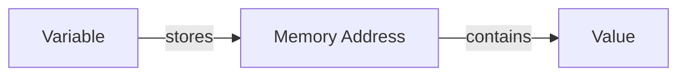

# 🎨 Visual Learning Diagrams

A collection of diagrams to help visualize programming concepts. **Perfect for visual and ADHD learners!**

---

## 🎯 Purpose

Complex concepts become easier when you can **see** them. This directory contains visual aids for:

- **Memory management** (stack, heap, pointers)
- **Data structures** (arrays, linked lists, trees)
- **Control flow** (loops, conditionals, recursion)
- **Program execution** (compilation, function calls, scope)

---

## 📂 Diagram Index

### C Programming Diagrams

| Diagram | Concept | Status |
|---------|---------|--------|
| `c-memory-layout.svg` | Memory segments (text, data, BSS, stack, heap) | 📝 Planned |
| `c-pointer-visualization.svg` | Pointer fundamentals (& and * operators) | 📝 Planned |
| `c-stack-heap.svg` | Stack vs heap allocation | 📝 Planned |
| `c-pointer-arithmetic.svg` | Pointer arithmetic and array access | 📝 Planned |
| `c-function-call-stack.svg` | Function call frames and stack growth | 📝 Planned |
| `c-double-pointers.svg` | Pointer to pointer visualization | 📝 Planned |
| `c-struct-memory.svg` | Structure layout in memory | 📝 Planned |
| `c-string-representation.svg` | String as char array with null terminator | 📝 Planned |

### Python Programming Diagrams

| Diagram | Concept | Status |
|---------|---------|--------|
| `python-flow-control.svg` | if/elif/else decision trees | 📝 Planned |
| `python-data-structures.svg` | List, dict, set, tuple comparison | 📝 Planned |
| `python-list-operations.svg` | List methods and slicing | 📝 Planned |
| `python-function-scope.svg` | Local vs global scope | 📝 Planned |
| `python-class-inheritance.svg` | OOP inheritance hierarchy | 📝 Planned |
| `python-decorator-flow.svg` | How decorators wrap functions | 📝 Planned |
| `python-import-system.svg` | Module and package structure | 📝 Planned |

---

## 🛠️ Creating Diagrams

### Recommended Tools

**Online (Free):**
- [Excalidraw](https://excalidraw.com/) - Hand-drawn style, simple
- [draw.io](https://app.diagrams.net/) - Professional diagrams
- [Mermaid Live](https://mermaid.live/) - Text-based diagrams

**Desktop:**
- [Inkscape](https://inkscape.org/) - Vector graphics (SVG)
- [GIMP](https://www.gimp.org/) - Raster images (PNG)

**Text-Based:**
```markdown
# Mermaid diagram example

```

### Diagram Guidelines

**Keep it simple:**
- One concept per diagram
- Clear labels and arrows
- Use color to highlight key parts
- Add a legend if needed

**Save in multiple formats:**
- `.svg` - Scalable, editable
- `.png` - Easy to view in README
- `.md` - Include explanation alongside diagram

---

## 📝 Diagram Template

For each diagram, create a corresponding `.md` file explaining it:

**Example: `c-pointer-visualization.md`**

```markdown
# Pointer Visualization

## What This Shows

How pointers store memory addresses and the & (address-of) and * (dereference) operators work.

## The Diagram


## Key Concepts

- `int x = 10` - Variable x stores value 10
- `int *p = &x` - Pointer p stores the address of x
- `*p` - Dereferencing p gives you the value at that address (10)
- `&x` - Address-of operator gives you the memory address

## Why This Matters

Pointers are C's way of indirectly accessing memory. Understanding this visualization helps you:
- Prevent segmentation faults
- Understand pass-by-reference
- Work with dynamic memory
- Debug pointer-related bugs
```

---

## 🎨 Color Coding Guide

Use consistent colors across diagrams:

- **Stack memory:** Light blue (#B3E5FC)
- **Heap memory:** Light green (#C8E6C9)
- **Pointers/Addresses:** Orange (#FFE0B2)
- **Values:** Yellow (#FFF9C4)
- **Function calls:** Purple (#E1BEE7)
- **Errors/Problems:** Red (#FFCDD2)

---

## 🧠 Learning Tips

### Before You Code
- Review relevant diagrams to understand the concept
- Draw your own version from memory
- Check against the original

### While Coding
- Sketch quick diagrams for complex logic
- Visualize memory layout for pointer operations
- Draw state changes for debugging

### After Coding
- Create a diagram if a concept finally clicked
- Update existing diagrams with new insights
- Share your diagrams to help others

---

## 📚 Diagram Ideas to Create

### C Programming
- [ ] Memory layout (text, data, BSS, stack, heap)
- [ ] Pointer fundamentals (address-of, dereference)
- [ ] Array and pointer relationship
- [ ] Stack frame during function call
- [ ] Dynamic memory allocation flow
- [ ] String representation (char array + '\0')
- [ ] Struct memory alignment
- [ ] Call by value vs call by reference

### Python Programming
- [ ] List vs tuple vs set vs dict comparison
- [ ] Function call and return flow
- [ ] Class and object relationship
- [ ] Scope resolution (LEGB rule)
- [ ] List slicing visualization
- [ ] Decorator execution flow
- [ ] Import system hierarchy
- [ ] Exception handling flow

---

## 🤝 Contributing Diagrams

### Adding a New Diagram

1. **Create the visual** using your preferred tool
2. **Save as SVG and PNG** in this directory
3. **Write the explanation** in a matching `.md` file
4. **Update this index** with the new entry
5. **Commit and push**

```bash
git add vault/diagrams/my-diagram.svg
git add vault/diagrams/my-diagram.png
git add vault/diagrams/my-diagram.md
git add vault/diagrams/README.md
git commit -m "Add diagram for [concept name]"
```

---

## 🔗 Related Resources

- [C Memory Cheatsheet](../cheatsheets/c.md)
- [Python Data Structures Cheatsheet](../cheatsheets/python.md)
- [C Mindmap](../mindmaps/c-concepts.md)
- [Python Mindmap](../mindmaps/python-concepts.md)

---

**See it. Draw it. Understand it. 🎨**

*Last updated: 2025-09-30*
